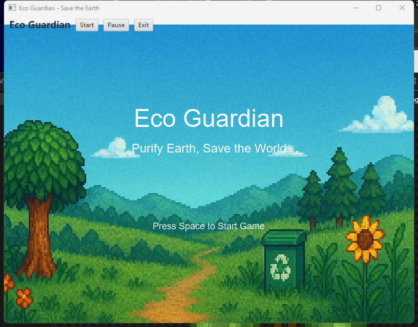
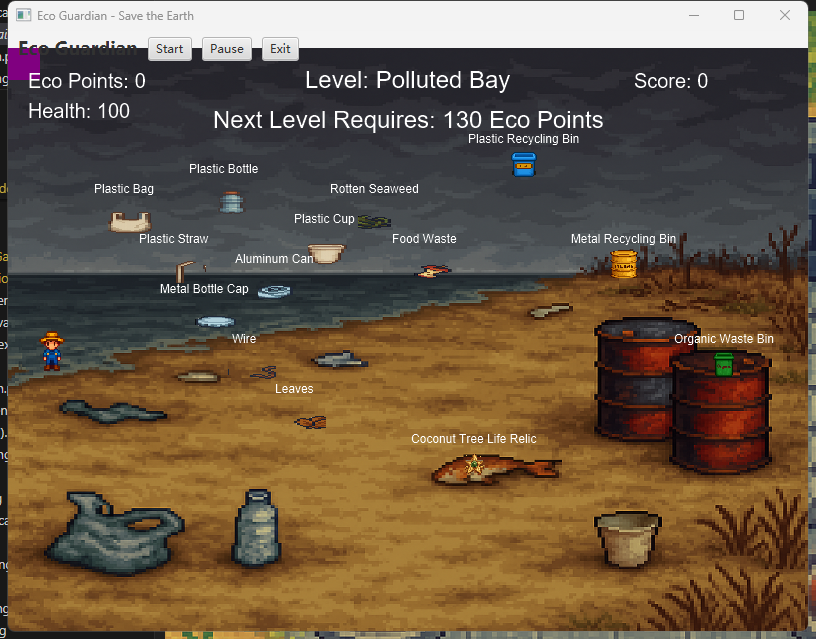
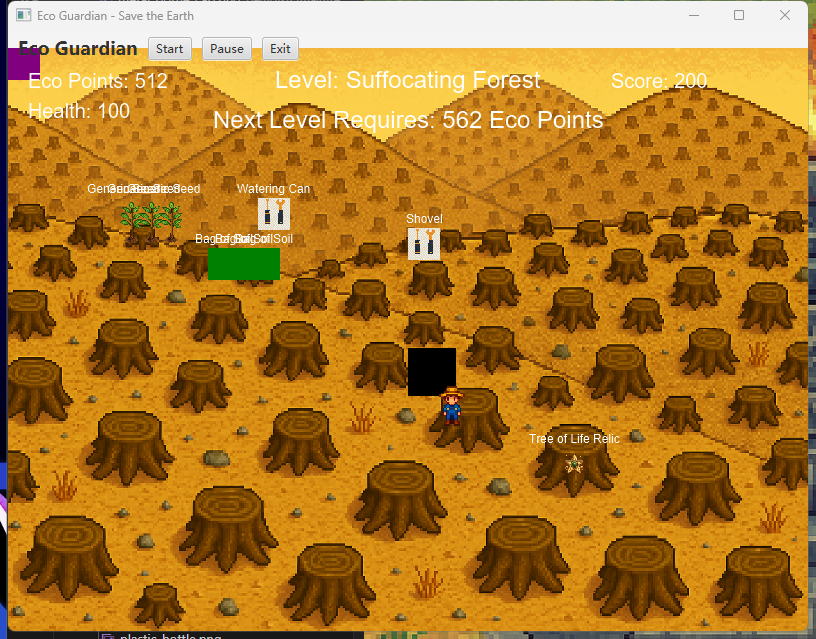
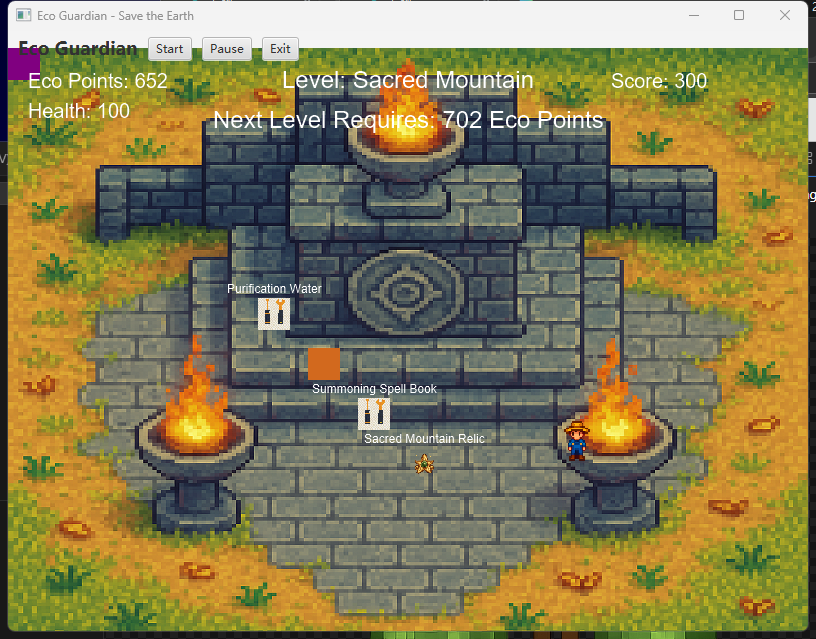
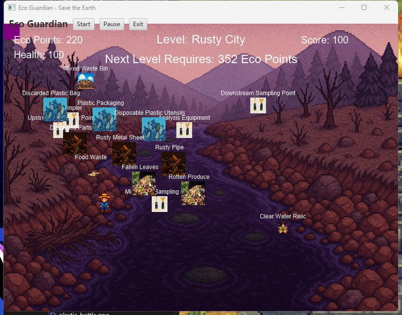

# Eco-Warrior Game

## Project Description

Eco-Warrior Game is a JavaFX-based educational game project designed to promote environmental awareness through interactive gameplay.

## Features

- Interactive JavaFX user interface
- Educational gameplay related to environmental protection
- User interaction and game logic implementation
- Object-oriented programming design

## Technologies Used

- Java
- JavaFX
- Maven

## My Contribution

- Developed game interface and functionality
- Implemented game logic and interactions
- Participated in design and testing

## Project Type

Academic Group Project – Universiti Teknologi Malaysia (UTM)

## Screenshots

### Start Screen

### Polluted Bay Level

### Suffocating Forest Level

### Rusty City Level

### Sacred Mountain Level

